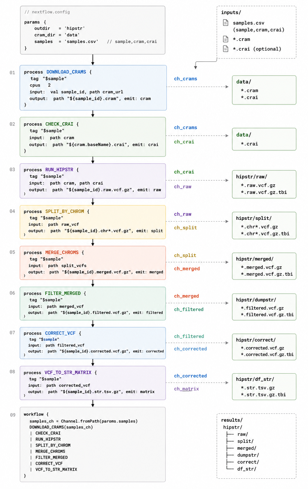

# HipSTR Pipeline

This repository contains a reproducible Nextflow workflow for the HipSTR STR calling pipeline on earth cluster.

## Simplified pipeline diagram



## Overall flow

1. **Download**
   - Reads `sample/cram_download.txt` and downloads CRAMs + `.crai` indexes to `data/`.

2. **Index validation**
   - Verifies CRAI files for the sample list and generates missing indexes.

3. **HipSTR calling**
   - Runs `HipSTR` per CRAM sample to produce raw HipSTR VCFs in `hipstr/raw/`.

4. **VCF splitting**
   - Splits each raw HipSTR VCF into chromosome-specific VCFs in `hipstr/split/`.

5. **Merge by chromosome**
   - Merges all sample chromosome VCFs into one per chromosome in `hipstr/merged/`.

6. **Filtering**
   - Applies `dumpSTR` filters to the merged chromosome VCFs, writing filtered output to `hipstr/dumpstr/`.

7. **Correction**
   - Runs `hipstr_correction.py` on filtered VCFs to fix overlapping or trimmed allele records, producing corrected VCFs in `hipstr/correct/`.

8. **Conversion**
   - Converts corrected VCFs into STR genotype matrix CSV files in `hipstr/df_str/`.


## Structure

- `main.nf` - Nextflow workflow orchestrating each pipeline stage
- `nextflow.config` - default pipeline configuration and tool paths
- `hipstr_correction.py` - VCF correction script used after filtering
- `hipstr_vcf.py` - converts corrected HipSTR VCFs into STR matrices


> Note: `hipstr_correction.py` is derived from the Gymrek lab repository: https://github.com/gymreklab/1000Genomes-STRs/blob/main/Hipstr_correction.py

## How to run

1. Install Nextflow: https://www.nextflow.io/
2. Review `nextflow.config` and update file paths for your environment.
3. Create the Conda environment and run the pipeline:

```bash
conda env create -f environment.yml
conda activate hipstr-pipeline
nextflow run .
```

4. To run using SLURM, use the `slurm` profile:

```bash
nextflow run . -profile slurm
```

## Configuration

The workflow uses parameters from `nextflow.config`:

- `ref` - reference FASTA
- `regions` - HipSTR regions BED
- `segdup` - segmental duplication BED for filtering
- `cram_download_list` - list of CRAM URLs for download
- `cram_list` - CRAM file names to process with HipSTR
- `filtered_vcf_list` - filtered VCF names passed to correction
- `correct_vcf_list` - corrected VCF names passed to matrix conversion
- `min_var` - minimum variance threshold for `hipstr_vcf.py`
- `chrs_list` - chromosome names used for merge/filter steps

## Output directories

- `data/` - downloaded CRAM and CRAI files
- `hipstr/raw/` - raw per-sample HipSTR VCF outputs
- `hipstr/split/` - chromosome-split VCFs
- `hipstr/merged/` - per-chromosome merged VCFs
- `hipstr/dumpstr/` - filtered VCF outputs
- `hipstr/correct/` - corrected VCFs
- `hipstr/df_str/` - final STR matrix CSV outputs

## Notes

- The workflow is intentionally parameterized so you can update paths without editing the pipeline logic.
- Existing shell scripts are retained in case you want to compare the Nextflow implementation with the original SLURM commands.
